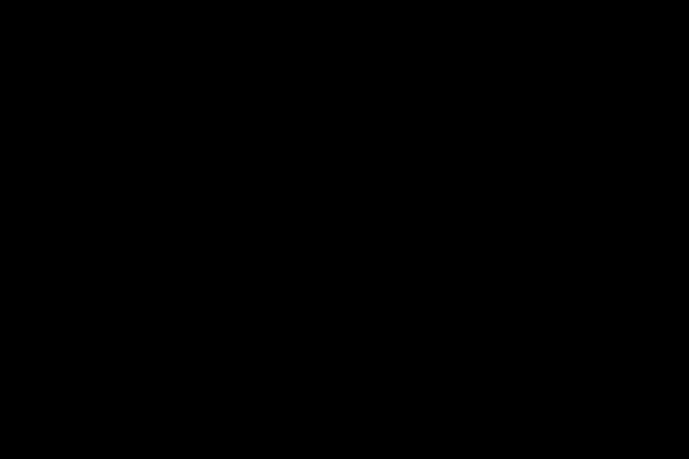

# Hi there 👋 I'm Riess-01

### AI • Quantum Machine Learning • Cybersecurity

---

## 👨‍💻 About Me

- 🔭 I'm currently working on Quantum Machine Learning
- 🌱 I'm currently researching AI and Quantum Computing
- 🔐 Interested in Cybersecurity
- 🧠 Researching ME-QCNN
- ⚛️ Exploring Quantum Machine Learning
- 💻 Computer Science & Technology

---

## 🚀 Research

- Modified Enhanced Quantum Convolutional Neural Network (ME-QCNN)
- Quantum Machine Learning
- Molecular Ground-State Energy Estimation
- Quantum Chemistry
- Artificial Intelligence

---

## 🛠️ Technologies

---

## 📊 GitHub Stats

---

> `SYSTEM STATUS: ONLINE`

